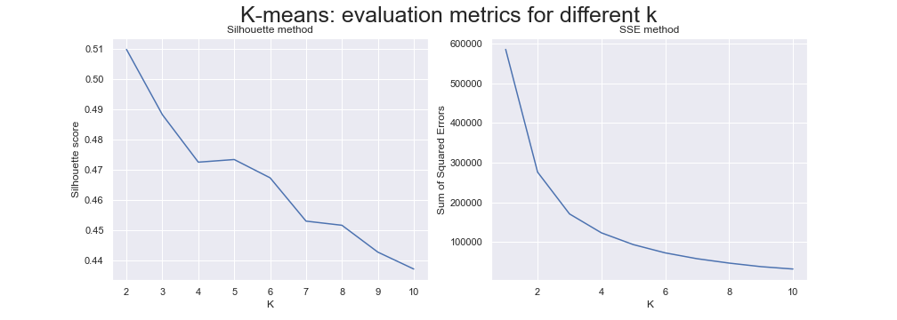
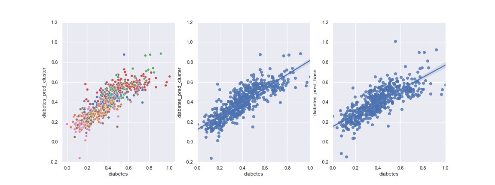

# Introduction

Nowadays, the supply chain is one of the key concepts when managing businesses dealing with food distribution. It is the key ingredient that will determine the efficiency of a distributor. We would like to see if we can come up with some tools to optimise this distribution, using the Tesco grocery dataset.
Tesco grocery 1.0 is a large-scale dataset detailing food consumption in London areas at a different level of aggregation.  Such a dataset allows us to study the different trends around London when it comes to food consumption.  

In our study, we will focus on tools that could help to deploy new products on the London market the most efficiently possible. In particular, we would like to come up with a solution that, given a new product and its characteristics, gives the area of London where to deploy it efficiently. When supplying shops with trucks one important thing is the used path to go to all shops. The longer this path is the costlier it gets to deliver the food. We won't work on how to design such a path but we will try to see if it is possible to deploy a product in a given area such that the neighbouring areas would also be inclined to use this product. More specifically, we will analyse if people from the same geographical area tend to eat the same way. We will do so by clustering the different areas of London by the characteristics ('sugar', 'protein'...) of their food consumption and compare this clustering the geographical positions of the areas.

Throughout this analysis, we try to give an answer to the following questions:

1. Are similar areas in terms of typical products geographically close?
2. Can we naturally cluster areas geographically when it comes to food consumption in London?
3. How do those clusters differ when we vary the aggregation level?
4. Are we able to validate the clustering results in a similar way as in the Tesco paper? Does the clustering contains valid and usable information?
5. In the context of an advertising campaign, which areas of the city should be associated with which kinds of products?

Before answering those questions, we will first visualise our dataset to understand if we could even hope to be able to demonstrate such a relationship between product and geography.

# Getting the data

The first thing we have to do is to obtain a list of geographical coordinates and shapes associated to each area (and for each aggregation level ```LSOA```, ```MSOA```, ```WARD```, ```BOROUGH```).  We use [Statistical GIS Boundary Files for London](https://data.london.gov.uk/dataset/statistical-gis-boundary-files-london) for this purpose. Even if this dataset was made available in 2011, we should note that the boundaries haven't really changed compared to 2015 (date of Tesco Dataset) and it should not impact our visualisation.

We can proceed further by reading the [Tesco grocery dataset](https://figshare.com/articles/Area-level_grocery_purchases/7796666). This dataset was shown to ecologically valid and can for example be used to comparing food purchase volumes to official statistics of food-related illnesses. During 2015, 420M food items purchased by 1.6M fidelity card owners in 411 Tesco stores across London have been recorded. For each purchase, the area in which the customer lives (instead of customer information,to preserve anonymity), the global trade item number, and the timestamp are stored. Products have nutrition information (e.g.,energy,fats) and are classified into 17 non-overlapping classes (e.g.,grains,red meat). This all looks really nice but we will ony use typical product-related information, such as

> ```fat, saturate, sugar, protein, carbohydrate, fibre, energy, calories, etc.```

Locally, we built an interactive visualisation that allows the user to explore this data set at several levels of geographical granularity, periods of time (month of 2015). It is also possible to select which typical product features we want to visualise. A small snapshot of it can be found right below. Our knowledge of web development did not permit us to directly embed the full interaction aspect in this website but reader is welcomed to [download it](https://github.com/giordano-lucas/ADA-2020-Tesco-Extension/tree/gh-pages) and play with it offline.




We can easily convince ourselves that we can indeed recognize some dependencies between typical product features and the geographical location of the areas. To capture the general trends (not by individual products) we will try to cluster the areas according to their typical product properties and see if we can quantify this geographical dependence formally.

# Clustering Validation

We will start by studying the output of a standard clustering algorithm named [K-means](https://en.wikipedia.org/wiki/K-means_clustering) to understand which values of ```k```(the number of clusters) will produce the most natural clustering __*in the typical product space*__. The next step will to try to make some sense of out this clustering by performing a visualisation in 2D using several dimensionality reduction techniques. We might hope that we will already be able to see some geographical structure in those plots (maybe recognize the map of London somehow). If not we will have to apply other techniques to help assess the geographical validation of the clusters.

## Naive Analysis
In this naive analysis, the geographical aspect of the dataset will not taken into account. Since we only want to get a feeling about how the clustering algorithm performs with the ```Tesco``` data, we select a subset of the dataset for this analysis. To be as precise as possible we study the smallest aggregation level (```lsoa```) for the entire year period. 

 As stated before, the starting point of this analysis is to understand which value of ```k``` leads to a good clustering assignment. The standard procedure for doing so is to look at the ```silhouette``` and ```sse``` plots.  

{:class="img-responsive"}

The elbow method applied on the SSE graph seems to indicate that 2 and 3  might be relevant choices of ```k``` for this dataset. Moreover, the silhouette graph also suggests that these values are fair tradeoffs between the goodness of the fit and the number of clusters. By curiosity, we will also keep ```k = 4``` as one of the best candidates. To analyse deeper the values of the silhouettes scores obtained for our candidates we plot the silhouettes score obtained by each data point of each cluster.

{:class="img-responsive"}

Silhouette scores can be interpreted as follows :
* 1  indicate that the sample is far away from the neighbouring clusters
* 0  indicates that the sample is on or very close to the decision boundary between two neighbouring clusters
* <0 indicate that those samples might have been assigned to the wrong cluster. 

Only for ```k = 4```, we observe higher variability scores (inside clusters) what indicates that the clustering might not be so good. However, for all ```k```, we do not have the presence of clusters with below average (red dotted lines) silhouette scores which is a good point.

In the previous point, we tried to formally understand the goodness of fit for the clusters found. Here, we will take a more visual approach. To do so we naively project the data on a 2D space using PCA and T-SNE algorithms. We plot the results and label them with the labels produced by the clustering (choose ```k=3``` among the candidates we listed earlier), hoping that the obtained figure will look like the map of London. We obtained the following figure:

{:class="img-responsive"}

Here we understand that ```k = 2``` might be a better choice if we think of TSNE. 

If we go back to our initial question, we tried to understand if there was a relationship between similar typical products and similar areas (geographical areas). At the beginning of this story, we thought that we might be able to recognize London from those simple dimensionality reduction 2D plots but this is clearly not the case. This does not mean that the previously mentioned relationship does not exist, it simply means that we have to think more carefully about how we are going to address the question. Thus we need to proceed with a deeper analysis of the clustering in the geographic space.

## Geographical Clustering visualisation 

In the previous paragraphs, we failed to show the presence of a geographical relationship between products and area. To have a better idea of how the clusters look like in the geographical space we create an interactive visualisation of these clusters on the real map of London similar as the one we already show you earlier. Again, to find the interactivity feel free to take a look at the offline visualisation.

For ```2``` clusters 
For ```4``` clusters 

Surprisingly, for many values of ```k```, we can actually make some geographical sense out of the clustering! Let's analyse further some of the plots:

* For ```k = 2```, across all aggregation levels, we can generally observe that the centre and top east part of London tend to be clustered together. If we take a look at the ```lsoa``` plot (the most precise aggregation level), we clearly see two __concentric__ circle-shaped clusters. A further analysis could try to relate these clusters to actual classes of people (for instance densely populated / wealthy areas, who knows?).
* For larger ```k```, this concentric cluster shapes tendency keeps appearing, which is really interesting given the fact that the K-Means algorithm didn't take any geographical metric into account.
* We can almost always distinguish a central cluster.

In the end, we see that the clustering looks quite decent and comforts us in the idea that we are able to give geographical meaning to them. Overall, these results are exciting but it would be interesting to formally quantify them.

## Formal Geographical Validation

In this section, we want to have a piece of more formal evidence that some of our clustering are good (what we saw on the visualisation). Thus we have to find metrics that could reflect the goodness of the clustering in the geographic space. 

### Geographical Silhouette

As a first step, we will try to use the silhouette score again but in the geographical domain. To do so we will compute the silhouette score as we did at the beginning of the study but this time we will use the geographical distance as the distance between data points. In order to be able to compare the future results, we will also compute the silhouette score produced by a random clustering. We do so hoping that our clustering will perform significantly better than the random one. 

{:class="img-responsive"}

We see that unfortunately, this does not go in the direction of a good evidence of fit. The scores are quite small compared to the ones we got in the naive analysis. They even go to negative values, meaning that, on average, points tend to be closer to other clusters than to their centroid, or at least the geographical sense. 

However, we need to take a step back and try to fully understand why such result has arisen. Indeed, we should remind ourselves that the silhouette score computation relies on the average distance to other points in the same cluster, to which we subtract the smallest mean distance to other points in other clusters. This metric is thus likely to produce high scores for dense clusters distributed as a Gaussian centred in the centroid. This is not the shape that we observed in our visualisation : we rather saw concentric circles, scattered around the map (they do not form unique blocks)! Indeed, if we were to run a K-means algorithm in the 2D geographical vector space, we would never get such concentric shaped clusters. 

If the silhouette metric is good when we want to evaluate clusters as described in the previous paragraphs, we understood that we should probably try another approach to evaluate our clusters.

### Graph analysis

This time, we will use a slightly different approach than the previous one. We again use the silhouette score but we will compute it using the following distance metric: the distance between two areas will be defined as the shortest path (smallest number of areas to cross) to go from one area to another. We do so because the centroids of similar areas might be far from each other even if the areas are located next to each other. We hope that by giving a slightly more geographical meaning to the distance measure, we will be able to better evaluate the clusters.

Note that we perform this analysis only on the lsoa aggregation level. 

We again compute silhouette score as above for different values of k, and compare it to a random clustering.

{:class="img-responsive"}

The obtained results are very similar to the previous analysis. We might have put to much hope on the changes made by the distance metric. This might be due to the fact that the silhouette score is not well suited for our application. Thus we need to define a more appropriate metric to evaluate the graph. Note that despite the fact that the silhouette score is bad we are still convinced that the clustering is meaningful in the geographic space (because of the visualisation).

### Border Scores

In this third attempt, a brand new metric is designed to evaluate if geographically close areas tend to belong to the same cluster of type. We proceed as following: for each area of the dataset we look at all its direct geographic neighbours and compute the number of neighbours belonging to the same cluster as the original area. We illustrated this in the following figure :


[](/images/example-border-score.png)
> Here the score computed for area 1 is two, area 1 belongs to the red cluster and has two red neighbours. 

Once we have computed this score for every area of the dataset, we group the result per cluster by averaging the previously computed scores. The obtained result is the following: for a given cluster (between 0 and k)  we know the expected number of neighbours belonging to the same given cluster. Since this metric depends on the average number of neighbours in the graph, we cannot simply say that the obtained number is high or low. To have a comparison basis we repeated the procedures described above but using random assignments for the labels. 

This new metric is defined more locally. A cluster can be split into two parts located at opposite sides of London and still obtain a good score (what we want) while still being fairly general (we do not want to design a metric that will always return a good score for what we are trying to show).

It would be nice to have a good plot to help us understand this metric. That's why we are going to produce several ```bar plots``` (one for each value of ```k```). We will then be able to compare the performance of our clustering compared to a random one.

{:class="img-responsive"}

At first sight, this already looks quite promising but let's dive into the details:

1. For each ```k```, almost all clusters do better than random.
2. When ```k``` increases, the clusters tend to resemble less and less to the random one, on average.
3. When ```k``` increases, clusters with a score extremely low (close to 0) appear

Using this metric and the visualisation, we are finally able to somehow demonstrate that there is indeed some evidence that the clustering on typical product produces, at the same time geographically similar clusters. 

If this result at least shows that we can come up with some metric to evaluate such a clustering task, it would be better if we got the same result using a different approach, just to assess the validity of our findings. However, due to the time constrains implied by this assignment, we decided not to take further steps in that direction.

# Cluster analysis

## Cluster typical products 

Now that we managed to assess the geographical validity of our clustering, let's try to use it!
In this section, we will analyse our clustering through the differences in the average typical product between the clusters. We choose ```k = 4``` and the ```Ward``` aggregation level in order to be able to relate our analysis to the number of [diabetes](https://drive.google.com/drive/folders/19mY0rxtHkAXRuO3O4l__S2Ru2YgcJVIA) within each cluster later on (data is only available for the ```Ward```)

{:class="img-responsive"}

We see from both the graphs that ```carbohydrates```, ```sugar``` and ```energy_tot``` are the most determining nutrient classes to separate the clusters (we have more information about the cluster of a given area if we know about the amount of carbohydrates its typical product has than any other nutrient class). On the opposite side, the number of proteins doesn't give much information.

This information can be used to answer one of our first questions : 
> "In the context of an advertising campaign, which areas of the city should be associated with which kinds of products?"

For example, a company selling a product that has a high concentration of carbohydrates and sugar can focus their advertising campaign on areas that belong to the 2nd cluster. 

## Diabetes prevalence comparison

According to the World Health Organization, the three best dietary habits to prevent conditions associated with the metabolic syndrome are:
1. limiting the intake of calories; 
2. having a nutrient-diverse diet; and   3. favouring the consumption of fibres and proteins over sugars, carbohydrates, and fat.

Given the previous plot and the metabolic syndrome conditions that are strongly linked to food consumption habits, we could expect to be able to observe differences in terms of the number of diabetes within each cluster.

Indeed, we could expect the cluster 2 to have a higher diabetes prevalence, followed by cluster 0 since their typical product's amount of sugar, fat and total energy is higher than for the two other clusters (this is at least what common sense could let us think). Let's verify this with proper data analysis. We will use the [dataset](https://drive.google.com/drive/folders/19mY0rxtHkAXRuO3O4l__S2Ru2YgcJVIA) that was used in the Tesco paper to perform this task. Let's first plot the diabetes prevalence average for each cluster.

{:class="img-responsive"}

It looks pretty clear on the plot that our intuition was good : there is a clear difference between clusters. Even though the errors bars between cluster 0 and cluster 2 seem to overlap, both are significantly higher than the two other clusters.

# Practical usage of clustering : a feature for Machine Learning models

In this section, we will do a replication of the obesity regression model defined in ```Tesco``` paper and we will try to improve it by including a new categorical feature : the clustering. We hope to be able to increase the amount of variability explained by the model (```R2```). Obviously, we will have to quantify the improvement and choose a ```k``` high enough to have a meaningful impact on the model. 

As a first step, we could run a simple OLS model that only takes the clustering features as dependant variable. This will directly tell us if there is any hope for them to constitute good features. Let's choose arbitrarily ```k = 4``` for this simple test.

| Variables             | Coef          | p-value  |
| 
| Intercept             | 0.2729        | 0.000    |
| C(cluster_4)[T.1]     | 0.0973        |   0.000  |
| C(cluster_4)[T.2]     |0.2820         |    0.000 |
| C(cluster_4)[T.3]     |0.1604         |    0.000 |

This is confirmed : there is a significant difference between all clusters (p-value < 0.05). The R-squared is not very high though (```R2 = 0.36```), which means that a lot about diabetes prevalence is not explained by this very simple model (which is natural). But still, we managed to show some important differences between the clusters, which suggests that our clustering is meaningful.

We are now ready to perform the actual regression task. Will first try to replicate the model summarised in table 2 of the Tesco paper in order to have a comparison basis

| Variables             | Coef            | p-value  |
| 
| Intercept             |  0.9357         | 0.000    |
| energy_carb           | 0.1887          |   0.004  |
| entropy               |-1.0245          |    0.000 |
| avg_age               | -0.1192         |    0.004 |
| female                | -0.1237         |   0.012  |
| transactions          |0.2851           |    0.000 |
| density               | -0.0766         |     0.025|

If we compare our result to table 2 in the paper, we find that our model is almost equal to the one used in the paper (```coef``` are all equal up to the 3rd decimal, standard errors are all equal and the ```R2``` matches). We have thus managed to create a similar set up as in the paper. Since we know that the variable used are relevant for this prediction task, we can refer to this model when we will study the impact including the clustering assignments as extra features to the model. The important metric to keep in mind is the ```Adj R2 = 0.613```, we will use this to compare with the models defined in the following cells.

To evaluate the predictive power of the clustering assignments, we will simply run the following experiment :

> For each value of ```k```, we fit a OLS using the same independent variables as in the paper but we will also add the categorical variable ```cluster_k```.

We record the following output metrics:

1. ```Adj R2```: standard metric of a regression task
2. ````mean significant clusters````: the number of clusters having a p-value smaller than ```5%```, meaning that we can reject the hypothesis that the fitted correspondent clusters actually have a 0 value (and therefore have some predictive power). We simply take the ```mean``` to be able to compare this between various values of ```k```

{:class="img-responsive"}

The results look interesting, we observe an increase in ```Adj R2``` when ```k``` grows, reaching a peak at ```k = 8```. The maximum value ```Adj_R2* = 0.685``` constitutes a significant improvement compared to the value of the base model (```Adj_R2* = 0.613```). With the fact that ```71%``` of the clusters are statistically significant, we can conclude that the added clusters have indeed some non-negligible predictive power. This could be explained by the fact that, as seen previously, the clustering assignments in themselves encode some geographical value which could have been exploited by the OLS model.

The previous plot also tells us that a certain number of clusters (not to low value of ```k```) is required in order to observe a good increase in ```Adj R2```. Using the fact that the proportion of significant cluster is somehow high for values of ```k < 8 (optimum here)```, a possible explanation might be that the predictive power hidden in the clusters is there but the too small number of clusters does not allow the OLS algorithm to fully decode all the geographical information. Augmenting the granularity appears to solve this problem, until we reach a peak, after which the clusters start to lose predictive power (more noise and less predicable when ```k``` grows).

{:class="img-responsive"}

If we compare the error made by the best model (with ```k = 8```) and the base model, we observe similar behavior in the general trend. The only point where they differ is the number of really bad classified areas (points far away from the tendency line). Indeed, especially for areas having a number of diabetes higher than 0.7, it can be seen that the model including the clusters manages to capture more variablity than the base one (points closer to the tendency line). Fortunately, that's something that can be related to the cluster assignments! We observe that only the ```green``` and ```red``` clusters for large value of ```diabtes```, this means that the model was given a slight advantge when we include the clusters as features.

#  Conclusion
Through this project we created some tools, such as an interactive map, to visualise London's areas and their corresponding typical product as given in the Tesco dataset. To get deeper into this analysis, we decided to use some unsupervised machine leaning techniques such a K-means clustering. We saw that clustering can be used to visualise the high dimensional typical product in 2D. We then displayed the resulting clusters on the map, which helped us to highlight some link between typical product of the different areas and their geographical location. To formally verify this link, we tried different approaches and, after some inconclusive attempts, we finally managed to formally support our claims.

We then analysed our clustering a bit deeper. We assessed the difference between the clusters in terms of the average typical product of each cluster. We showed some huge difference and explained how this could be used in finding the optimal target region in the context of an advertising campaign for example (which answered one of our first questions). We also cross-referenced this clustering data with London's data about diabetes prevalence to try to assess some underlying link. This was successful and some significant differences in the diabetes prevalence was highlighted between the clusters.

We believe that the this analysis answers all of the initial questions, by the (interactive) visualisations and the formal analysis. There are other areas in which such an analysis can be useful, such as
* Adapt product offer/prices for grocery shops
* Supply chain management improvements : optimise truck journey
* Insurance : adapt prices according to the level of risk induced by food on health according to geographical areas
* Marketing / Advertisement
* Trash : create new installations/facilities to better fit the demand at geographical levels: add more plastic trash in clusters with high consumption of sugar for instance

There are many fields of application of such a study. In the end, we can easily imagine how we could extend our work further. All of our study raises more question related to food : can we relate wealthier areas in terms of the clustering found, etc.
